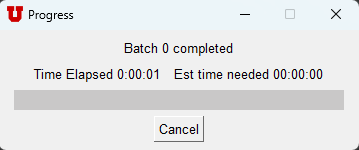

# Gardner API Utility

A collection of data source api call utilities.

# VERSION INFO
1. Python=3.10
2. pandas~=1.5.2
3. requests~=2.28.1
4. beautifulsoup4~=4.11.1
5. pysimplegui~=4.60.4
6. cryptography~=38.0.1
7. pillow~=9.2.0

_Note: Use latest viable requirements for versions above_

# Authentication Requirements
Authentication Keys are needed for utahrealestate.com and constructionmonitor.com

The program provides a safe way to store and use authentication keys

# ScreenShots

<h4>Main Screen</h4>

<h4>Construction Monitor</h4>

<h4>Utah Real Estate</h4>

<h4>Authorization Utility</h4>

<h4>Batch Request progress</h4>

<h4>Batch Confirmation Popup</h4>

<h4>Interactive Progress Bar</h4>

<h4>Confirmation Popup</h4>

# License
Copyright (C) Willem van der Schans - All Rights Reserved.

THE CONTENTS OF THIS PROJECT ARE PROPRIETARY AND CONFIDENTIAL.
UNAUTHORIZED COPYING, TRANSFERRING OR REPRODUCTION OF THE CONTENTS OF THIS PROJECT, VIA ANY MEDIUM IS STRICTLY PROHIBITED.

The receipt or possession of the source code and/or any parts thereof does not convey or imply any right to use them
for any purpose other than the purpose for which they were provided to you.

The software is provided "AS IS", without warranty of any kind, express or implied, including but not limited to
the warranties of merchantability, fitness for a particular purpose and non infringement.
In no event shall the authors or copyright holders be liable for any claim, damages or other liability,
whether in an action of contract, tort or otherwise, arising from, out of or in connection with the software
or the use or other dealings in the software.

The above copyright notice and this permission notice shall be included in all copies or substantial portions of the Software.
